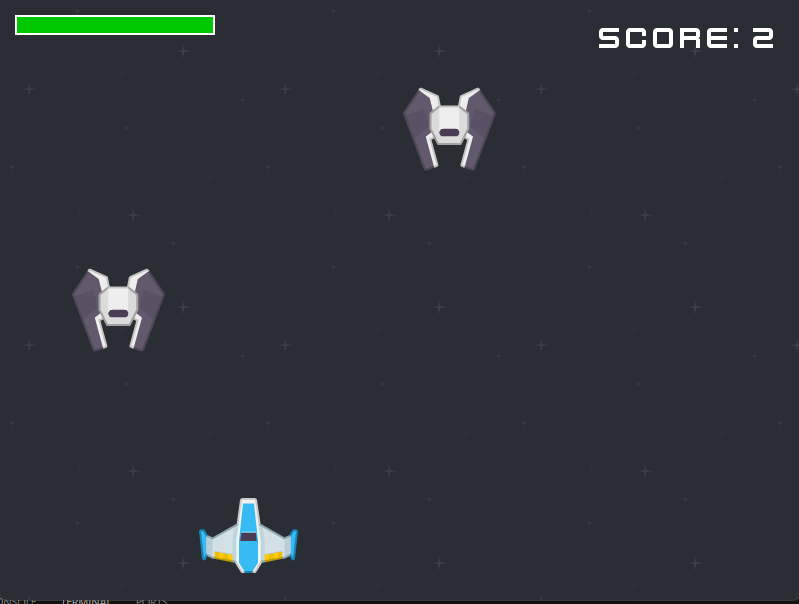
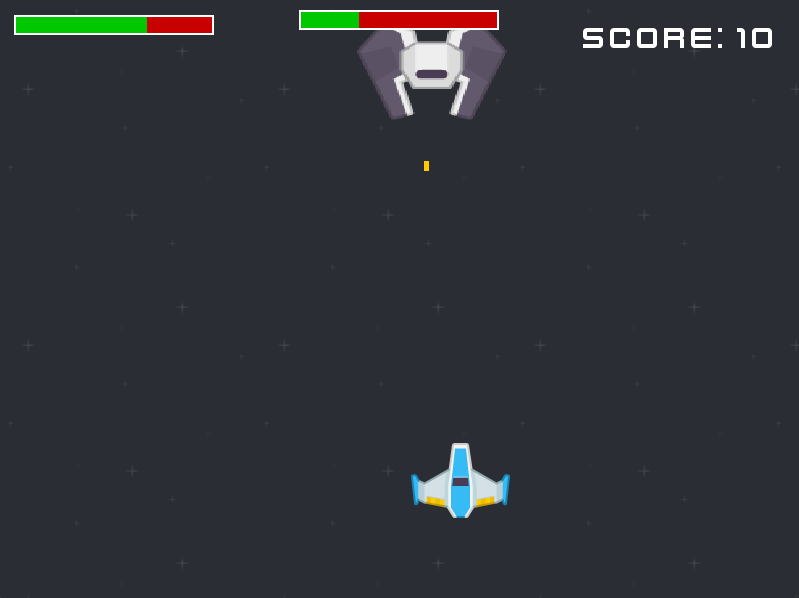

# 🚀 Space Game - Práctica 3

**Autor:** Pablo Illescas  
**Versión:** 1.0  
**Tecnología:** Python + Pygame (-ce)

---

## 🎮 Descripción del Juego

Un arcade shooter espacial donde controlas una nave con sistema de propulsión avanzada. El juego cuenta con una arquitectura de estados que incluye pantalla de título, modo de pausa y reinicio automático de estadísticas.

---

## 🕹️ Controles de Vuelo

| Acción | Tecla / Control |
| :--- | :--- |
| **Moverse** | `W`, `A`, `S`, `D` / **Flechas de Dirección** |
| **Disparar / Iniciar** | `Espacio` |
| **Turbo (Sprint)** | `L-Shift` (Shift Izquierdo) |
| **Pausar Juego** | `P` |
| **Menú / Salir** | `Esc` |

---

## ✨ Características Técnicas

* **Gestión de Estados:**
  * Soporta transiciones fluidas entre Menú -> Juego -> Pausa.
* **Gestión de Eventos:**
  * Temporizadores sincronizados con el estado del juego (los enemigos no se generan en pausa).
* **Audio:**
  * Música de fondo persistente para cada estado.
  * Canal de sonido exclusivo para el motor con detección de movimiento.
  * Efectos de sonido para disparos y explosiones.
* **Renderizado:**
  * Mosaico de fondo (Tiled background) infinito.
  * UI dinámica alineada a la derecha con manejo de `Rect`.
  * Limitación de 60 FPS estables.
* **Herencia y Polimorfismo:**
  * Implementación de una jerarquía de enemigos (Base -> Boss) con comportamientos de movimiento y ataque diferenciados.
* **Interfaz de Usuario (HUD):**
  * Sistema de barras de salud dinámicas para el jugador y el jefe, calculadas proporcionalmente a la salud actual/máxima.
* **Lógica de Combate Avanzada:**
  * Sistema de colisiones que distingue entre proyectiles aliados y enemigos para evitar daño al jugador con sus propios proyectiles.

---

## 🆕 Novedades

* **Boss Fight:**
  * Cada $X$ puntos, 5 por defecto, aparece un jefe con mayor tamaño, movimiento lateral inteligente y ataque con proyectiles.
* **Sistema de Daño:**
  * El jugador no muere al primer contacto, permitiendo una experiencia de juego más permisiva y estratégica.

## 🏗️ Arquitectura de Clases

```text
Enemy (Clase Base)
 └── Boss (Hereda de Enemy)
      ├── Movimiento: Lateral + Rebote
      └── Ataque: Proyectiles automáticos
```

## 🛠️ Requisitos e Instalación

1. **Python 3.x** instalado.
2. **Librería Pygame:**

    ```bash
    pip install pygame
    ```

    o **Librería Pygame Community:**

    ```bash
    pip install pygame-ce
    ```

## ⏯️ Ejecución

```bash
python game.py
```

## 📁 Estructura de Carpetas

Para el correcto funcionamiento, el proyecto debe estar organizado así:

```text
/
├── assets.py
├── enemy.py
├── game.py
├── player.py
├── proyectile.py
├── settings.py
├── audio/
│   ├── Explosion.wav
│   ├── laser.ogg
│   ├── Level 1.wav
│   ├── thruster.ogg
│   └── Title Screen.wav
├── sprites/
│   ├── bg.png
│   ├── enemy.png
│   ├── ship.png
│   └── titleBG.jpg
└── fonts/
    ├── future-earth.ttf
    └── kenvector_future.ttf
```

## 📸 Capturas



